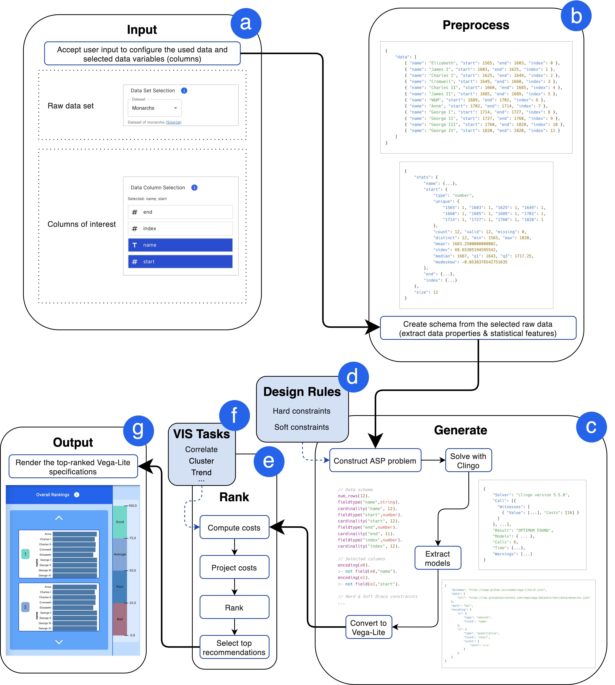

# VisRecly


## What Is This All About?

_VisRecly_ is a task-based visualization-recommendation tool with the goal in mind to allow novice VIS users to create
novel visualizations quickly for their dataset, solely by uploading it, then specifying what they would like to achieve
with their data (e.g. correlate, find differences, cluster, etc.).

This idea and project were so interesting to me that I decided to make it the project for my Bachelor's Thesis at the CS
department of Universität Wien. I enjoy the supervision of [Torsten Möller](https://research.com/u/torsten-moller)
and [Manfred Klaffenböck](https://www.cg.tuwien.ac.at/staff/ManfredKlaffenb%C3%B6ck).

**You can read the full thesis [here](https://visrecly.vercel.app/visrecly_thesis.pdf)**.

### Decomposing the Project's Name and Ambitions

The first part, _VisRec_, stands for **Vis**ualization **Rec**ommendation, while the _ly_ segment is a
tribute to Grammarly (the grammar checker) which inspired me to jump into this project. As I exposed myself to formal,
academic concepts of visualization and visual data analysis, I realized that a Grammarly-like tool for visualization
would be beneficial to VIS novices.

There is an untold story behind every single set of data and visualizations provide great means to tell these stories.
Yet, just as people do not enjoy written stories being full of grammar or spelling mistakes or being out of tone, they
also do not enjoy looking at visualizations violating fundamental design guidelines or being out of context regarding
the task at hand.

On the one hand, as Grammarly dictates grammar and spelling rules for writing, VisRecly aims at enforcing non-negotiable
visualization
design guidelines in its recommendations. On the other hand, just as Grammarly allows for recommending synonyms and
alternative sentence structures based on the communication goals and target audience of the author, VisRecly attempts to
help its users
find the "tone" of their visualization by ranking recommendations across tasks and highlighting the most suitable ones.

### Tech Overview

In an attempt to make this tool as intriguing and accessible as possible, I am building it with modern web technologies,
such as:

- React, Next.js
- Material-UI, TailwindCSS
- Pure TypeScript & WebAssembly

This monorepo is made up of the modules below:

- `libs/data`: Houses example data sets and related utilities.
- `libs/draco`: The core of the underlying recommendation engine, defining learning and visualization design guidelines
  as
  Answer Set Programming (ASP) problems. It is a custom fork
  of [draco by UW Interactive Data Lab](https://github.com/uwdata/draco).
- `libs/draco-web`: Custom web-API leveraging the core API introduced in `libs/draco`
  and [`clingo-wasm`](https://github.com/domoritz/clingo-wasm) to solve ASP programs in the browser, eliminating the
  need for a server component.
- `libs/ranking`: Defines the ranking algorithm and aggregator utilities, considering both data-oriented costs (obtained
  from `libs/draco-web`) and VIS-task-relevant preferences.
- `libs/vis-tasks`: Defines the VIS tasks and their associated mark-preferences.
- `apps/dashboard`: The actual client of the above modules, the dashboard that allows users to steer their desired
  tasks and marvel at the generated vega-lite-based visualizations.

### Architectural Overview



- **(a) Input**: accepts user input (`apps/dashboard`)
- **(b) Preprocess**: prepare data schema (`libs/draco`)
- **(c) Generate**: Solve ASP problems and produce Vega-Lite specifications (`libs/draco-web`)
- **(e) Rank**: Compute recommendation costs and rank visualizations (`libs/ranking`)
- **(g) Output**: Render the ranked visualizations (`apps/dashboard`)
- **(d)** and **(e)** are knowledge sources for design guidelines and VIS tasks (`libs/data`, `libs/vis-tasks`)

## Development

Make sure to install the monorepo dependencies.

```shell
npm install
```

### Starting the Project Locally

```shell
npm run start
```

The dashboard should be running on [localhost:4200](http://localhost:4200).

### Running Tests

~~Running _what_?~~

Tests are available for `libs/draco`. They can be executed by running:

```shell
npx nx test draco
```
